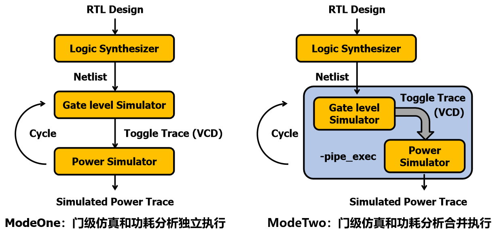
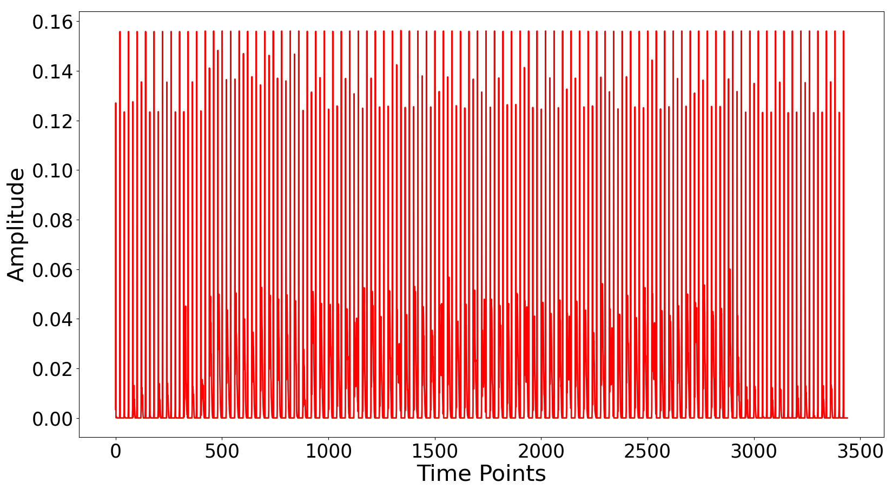
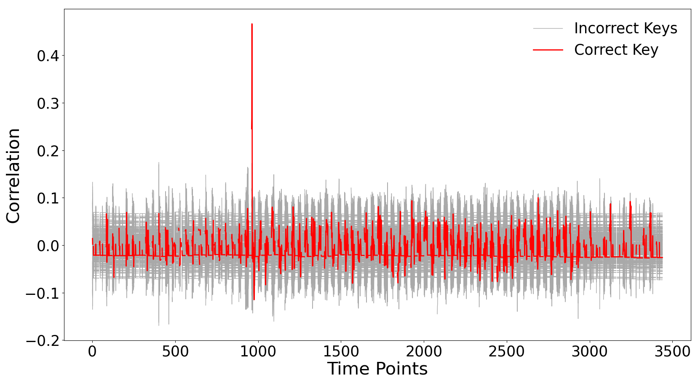
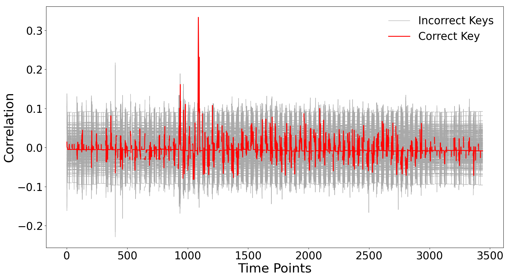
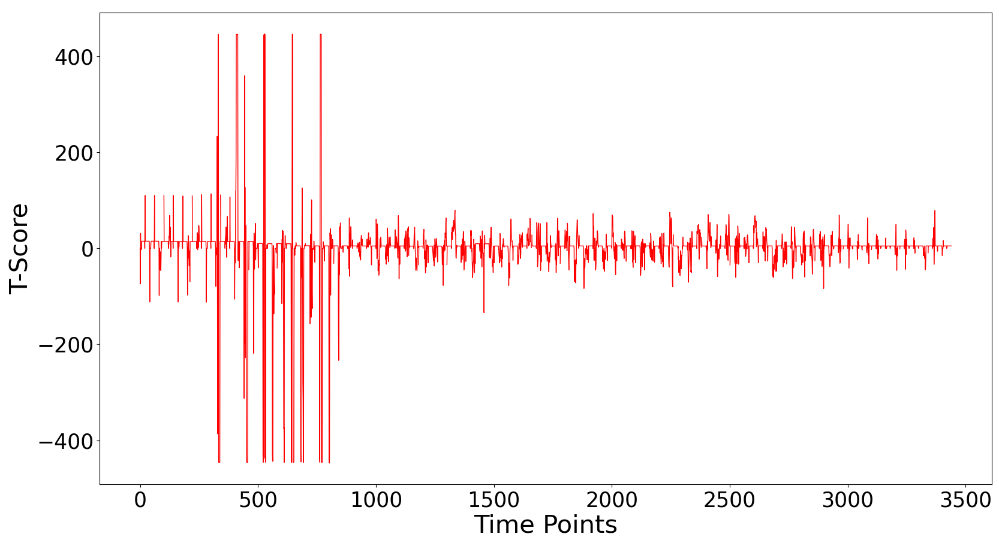

一切测评是为了更安全的设计，安全测评发生在芯片设计环节，有利于尽早发现信息泄露问题，以更高的灵活性开展安全设计。

PowSim是门级功耗安全测评工具，基于门级网表预测功耗行为，在硅前阶段验证侧信道安全。

### 环境配置

- 操作系统：Linux or Windows
- EDA软件：VCS, PrimeTime PX
- 依赖项：Python 3.x with Scared

### 实现框架

PowSim主要包含以下三个步骤：
- 门级仿真：在给定测试激励下记录逻辑单元的翻转活动；
- 功耗分析：选择瞬态功耗分析模式，仿真电路模块的实时功耗值；
- 安全评估：利用侧信道分析方法，验证密码模块的安全性。



具体来说，PowSim通过setup.py联合门级仿真和功耗分析，依次执行simcycle组仿真任务，每次仿真stimunum条功耗曲线，最终获得指定规模的测评数据。在此期间，通过timelist=[start_timepoint, timeperiod, inter_timepoint, timescale]定义功耗仿真的时间参数，例如仿真起始点、时间范围、相邻仿真间隔和时间精度。

PowSim提供了两种运行模式。在ModeOne模式中，门级仿真和功耗分析独立运行，PTPX读取VCS实际保存的VCD文件，仿真结束后VCD文件仍然存在。在ModeTwo模式中，门级仿真和功耗分析合并运行，PTPX通过管道直接读取VCS产生的VCD文件，无需保存大规模的数据文件。

#### 数据准备

##### 1. 门级仿真的文件介绍：

| 门级仿真     | 文件描述 | 
| :---        | :---        |
| 输入文件     | 门级网表（aes_top.v）、仿真激励（tmplTestBench.v）、标准单元模型（smic18_neg.v）、编译仿真（sim、run.f）、SDF文件（aes_top.sdf，可选）       |
| 输出文件     | VCD文件（SwitchFile.vcd），明文密钥（StimuliFile.txt）        | 

（1）仿真激励文件tmplTestBench.v位于data文件夹，setup.py以此为模板创建tb_main.v文件，作为实际运行使用的仿真激励。

在main语句块的for循环中，$urandom函数生成随机明文，保持密钥tarkey固定，AES模块循环stimunum次加密运算，并输出明文密钥到StimuliFile.txt文件。

在ptpx语句块的for循环中，\$dump系列函数记录单元翻转活动，通过start_timepoint，timeperiod，inter_timepoint选定时间范围，并输出到SwitchFile.vcd文件。

\$dumpfile定义输出VCD文件的名称，\$dumpvars指定待记录的所有信号，\$dumpall记录当前时间点选定信号的值，\$dumpoff表示中断选定信号值的记录活动，\$dumpon重新恢复记录选定信号的值。

```verilog
module tb_main;

    // Inputs, outputs and instantiate the Unit Under Test (UUT)
    // Back annotate delay values from SDF file to Verilog design

    initial 
    begin: main
        $display (" AES simulation start ");
        stimufile = $fopen("StimuliFile.txt", "a");
        ......
        for (i=0; i<stimunum; i=i+1)
            begin
            block = { tarkey, $urandom, $urandom, $urandom, $urandom };
            $fwrite(stimufile, "%h\n", block);
            ......
            end
        $display(" AES simulation done ");
        $fclose(stimufile);
        $finish;
    end

    initial
    begin: ptpx
        #start_timepoint;
        $dumpfile("SwitchFile.vcd");
        $dumpvars(0,tb_main.uut);
        for (j=0; j<stimunum; j=j+1)
            begin
            $display("Current Loop: %d", i);
            $dumpon;
            #timeperiod;
            $dumpoff;
            #inter_timepoint;
            end
    end	

endmodule
```

（2）编译仿真文件sim由setup.py生成，+ntb_random_seed指定仿真初始种子，用于指导$urandom函数生成随机数据。

```shell
vcs -Mupdate \
......
+ntb_random_seed=integer
```
##### 2. 功耗分析的文件介绍：

| 功耗分析     | 文件描述 | 
| :---        | :---        |
| 输入文件     | 功耗分析脚本（ptpx.tcl）、门级网表（aes_top.v）、SDC文件（aes_top.sdc）、工艺库（.lib、.db）、VCD文件（SwitchFile.vcd）、SPEF文件（aes_top.spef，可选）       |
| 输出文件     | 功耗数据（PowerFile.out）        | 

功耗分析脚本ptpx.tcl由setup.py生成，根据选择的PowSim运行模式，read_vcd命令具有不同的处理方式。

（1）ModeOne模式：

```TCL
read_vcd ./SwitchFile.vcd -strip_path tb_main/uut
```

（2）ModeTwo模式：

```TCL
read_vcd -pipe_exec "command from sim file" SwitchFile.vcd -strip_path tb_main/uut
```

在功耗分析脚本ptpx.tcl中，set_power_analysis_options设置生成波形的相关选项，waveform_interval指定功耗波形的采样间隔，include指定功耗波形的电路层次，waveform_format指定输出波形的文件格式，waveform_output指定输出波形的文件路径。

```TCL
set_power_analysis_options -waveform_interval 1 -include top -waveform_format out -waveform_output ./PowerDirs/PowerFile
```

#### 运行流程

1. 按照需求准备所有的输入文件，修改tmplTestBench.v文件和run.f文件；
2. 按照需求修改setup.py的getVcsSim()函数，增减VCS编译仿真选项；
3. 根据上述文件运行VCS仿真，预先验证门级仿真的正确性；
4. 按照需求修改setup.py的getPtpxSim()函数，包括功耗分析的各项命令和文件路径；
5. 根据上述文件运行PTPX仿真，预先验证功耗分析的正确性；
6. 按照需求设置setup.py的输入参数，包括simcycle、stimunum、timelist=[start_timepoint, timeperiod, inter_timepoint, timescale]；
7. 启动终端并运行setup.py脚本，选择PowSim的运行模式，最终得到功耗数据集PowerTrace.h5，包含simcycle组功耗曲线，格式为stimunum x (timeperiod / timescale)的矩阵数组；
8. 选择安全评估方法（CPA/DPA/T-test），基于上述仿真得到的功耗曲线，利用Scared评估密码模块的安全性（Scared是eShard团队开源的侧信道分析工具，也可选择其他的侧信道分析工具）。

#### 结果分析

##### 1. 功耗仿真结果：

（1）两种模式的时间开销比较：

| 运行模式      | ModeOne      | ModeTwo      |
| :---         | :---         | :---         |
| 1000条曲线   | ~ 18 分钟     | ~ 13 分钟    |
| 10万条曲线   | ~ 28 小时     | ~ 20 小时    |  

测试环境：Intel(R) Xeon(R) Gold 6230 CPU @ 2.10GHz 

（2）AES模块运行过程的仿真功耗：



##### 2. CPA攻击结果：

（1）攻击点：字节替换操作；泄露模型：汉明距离模型

```diff
真实密钥： 1,  35,  69, 103, 137, 171, 205, 239,  18,  52,  86, 120, 154, 188, 222, 240
猜测密钥： 1,  35,  69, 103, 137, 171, 205, 239,  18,  52,  86, 120, 154, 188, 222, 240
```

其中，第四字节对应的相关性曲线：



（2）攻击点：字节替换操作；泄露模型：汉明重量模型

```diff
真实密钥： 1,  35,  69, 103, 137, 171, 205, 239,  18,  52,  86, 120, 154, 188, 222, 240
猜测密钥： 1,  35,  69, 103, 119, 171, 205, 239,  18, 156,  68,  79, 112, 112, 130, 107
```

其中，第四字节对应的相关性曲线：



##### 3. T-test检测结果：

（1）随机明文，固定密钥 vs. 固定明文，固定密钥



### ToDo

- SM4/RSA/ECC模块的测试结果
- 功耗分析：综合网表 ± SDF仿真
